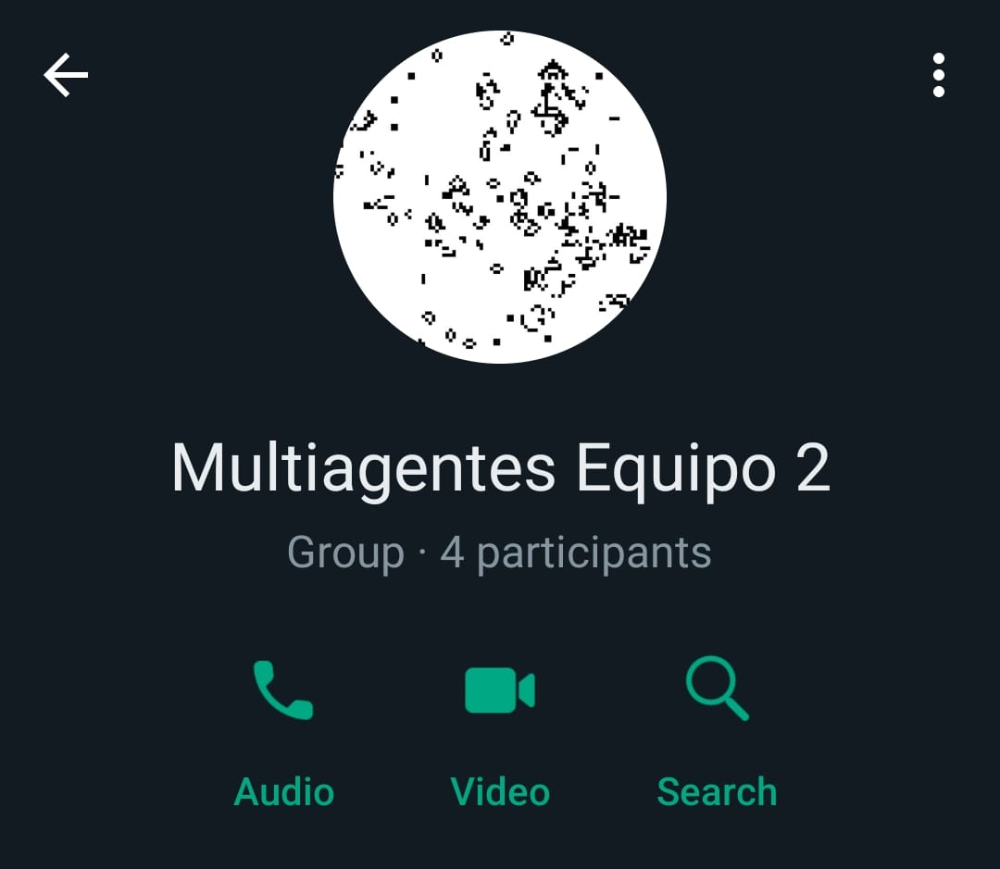

# Modelación de sistemas multiagentes con gráficas computacionales (TC2008B.102)

Equipo 2  
Actividad: M5. Revisión de avance 1  
Fecha de entrega: 15 de agosto de 2023  
Profesores:  
- Edgar Covantes Osuna  
- Raúl Valente Ramírez Velarde  

| Nombres | Apellidos | Matrícula |
|---------|-----------|-----------|
| Gustavo | Téllez Mireles | A01747114 |
| Eduardo Francisco | Lugo Quintana | A01747490 |
| Ramón Yuri | Danzos García | A00227838 |
| María Fernanda | Argueta Wolke | A00830194 |

## Conformación del equipo

### Gustavo Téllez Mireles (A01747114)
**Fortalezas**
- Persistente en los proyectos que hago
- Bueno trabajando en equipo
- Motivación por lograr buenas calificaciones en la carrera
- Me adapto bien a nuevos ambientes

**Áreas de oportunidad**
- Horario muy ocupado y solo con disponibilidad en tardes
- No le doy la prioridad a mi bienestar que se merece, pongo otros aspectos de mi vida antes
- Procrastino en ciertas ocasiones, pero no en proyectos importantes.

### Eduardo Francisco Lugo Quintana (A01747490)
**Fortalezas**
- Trabajo en equipo con facilidad
- Responsable para las tareas
- Resiliente
- Tolerante
- Escucho todas las ideas

**Áreas de oportunidad**
- Procrastino demasiado las tareas aunque nunca me ha afectado en las calificaciones
- Poco tiempo
- Poco conocimiento del área

### María Fernanda Argueta Wolke (A00830194)
**Fortalezas**
- Proactividad
- Responsabilidad
- Trabajo bien bajo presión
- Interés por aprender cosas nuevas y diferentes.

**Áreas de oportunidad**
- Suelo dejar las cosas para último momento.
- Me gusta que las cosas queden bien estéticamente y eso me quita tiempo a veces.
- Necesito tener un espacio sola cuando quiero concentrarme bien.

### Ramón Yuri Danzos García (A00227838)
**Fortalezas**
- Resiliente
- Bueno organizando
- Trabajo en equipo
- Bueno trabajando bajo presión
- Buen nivel de conocimiento en Unity

**Áreas de Oportunidad**
- Poco conocimiento de multiagentes
- Dificultad para comprender la lógica de los agentes
- Poco tiempo disponible

## Expectativas de la clase

- Facilitación de aprendizaje individual en temas que se requiera, mediante material extra de apoyo y fuentes de información adicionales.
- Espacios para trabajo en equipo cuando se requiera debido al corto plazo de la entrega final.
- Tener las bases de inteligencia artificial para saber si es un área de mi interés.
- Retroalimentación continua por parte de los profesores para poder tener un mejor proyecto.
- Participación por parte del socio formador.

## Lo que esperamos lograr

- Crear un proyecto satisfactorio para el socio formador que cumpla adecuadamente sus requerimientos.
- Una buena comunicación en el equipo con juntas constantes cuando se requieran.
- Mejorar nuestras habilidades en programación de multiagentes, simulaciones y programación en general.

## Compromisos

- Asegurar que el trabajo se encuentre dividido equitativamente.
- Tener los archivos necesarios para las entregas con puntualidad.
- Ser muy comunicativos para evitar conflictos.

## Herramientas de colaboración

- [Repositorio en GitHub](https://github.com/VMink/Multiagentes.git)
- Herramienta de comunicación: Grupo de WhatsApp
- 
